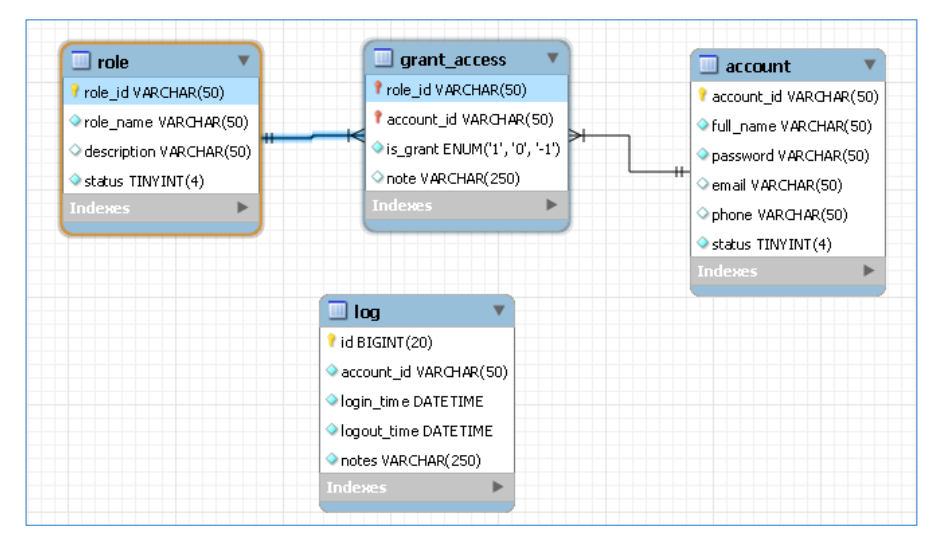
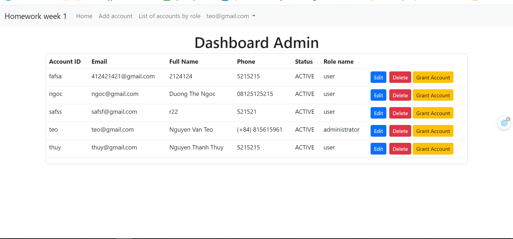

## Hi I'm Bac 

Tools and Technologies
   

### Database diagram

### UI when successfully logged in with admin role

### Program functions
- Thêm mới một tài khoản
- Cập nhật thông tin tài khoản
- Xóa một tài khoản
- Hiển thị danh sách tài khoản theo quyền
- Phân quyền tài khoản khi đăng nhập
- Ghi log mỗi khi đăng nhập thành công
